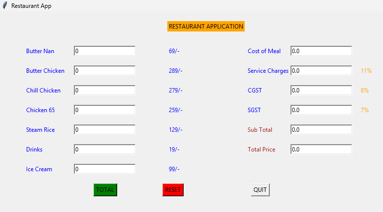

# 🍽️ Restaurant Billing Application (Python Tkinter)




A stylish and user-friendly **Restaurant Billing System** built using **Python & Tkinter** to calculate the total bill with taxes and service charges automatically.

> ✅ Perfect for beginners
> 
> ✅ Ideal mini-project for college
> 
> ✅ Clean GUI for easy billing
> 
> ✅ Accurate bill calculation

---

## ✨ Highlights

✔ Interactive Graphical Interface

✔ Real-time bill calculation

✔ Automatic service charge (11%)

✔ Automatic CGST (8%)

✔ Automatic SGST (7%)

✔ Clear & reset feature

✔ Exit button for safety

✔ Beginner-friendly code

---

## 🍛 Menu & Pricing

| Item           | Price (₹) |
| -------------- | --------- |
| Butter Nan     | 69        |
| Butter Chicken | 289       |
| Chilli Chicken | 279       |
| Chicken 65     | 259       |
| Steam Rice     | 129       |
| Drinks         | 19        |
| Ice Cream      | 99        |

---

## 💰 Taxes & Charges

| Charge Type    | Rate |
| -------------- | ---- |
| Service Charge | 11%  |
| CGST           | 8%   |
| SGST           | 7%   |

---

## ▶️ How to Run the App

### Step 1: Install Python

Download Python from python.org

### Step 2: Run Program

```bash
python restaurant.py
```

---

## 📁 Project Structure

```
Restaurant-Billing-App/
  ├── restaurant.py
  └── README.md
```

---

## 📌 How to Use

1️⃣ Type quantity for each item
2️⃣ Click **TOTAL** to generate bill
3️⃣ Click **RESET** to clear values
4️⃣ Click **QUIT** to exit safely

---

## 🛠 Technologies Used

* Python
* Tkinter (GUI)

---

## 👨‍💻 Author

**Tirupathi Rao**
MCA Student | Python Learner

---

## ⭐ Support & Feedback

If you found this project useful, please give a ⭐ star on GitHub!
Feedback and suggestions are always welcome 🙌

---

## 📄 License

Free for students and learning purpose.
